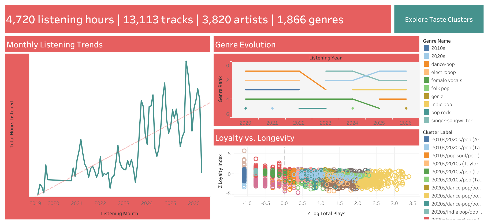
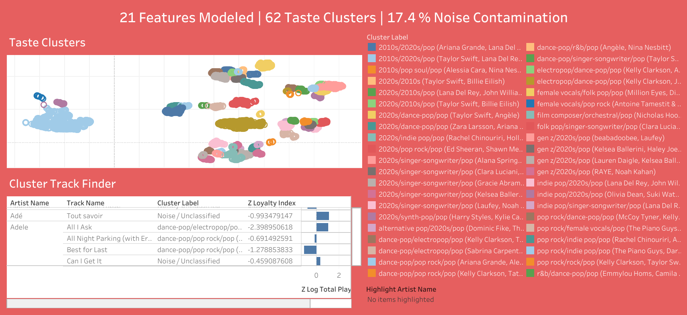

# Apple Music End-to-End Analytics & Machine Learning Pipeline

An end-to-end data engineering and unsupervised machine learning pipeline that transforms raw, chronological streaming history into an enriched relational PostgreSQL database, culminating in a high-fidelity behavioral cluster map and a content-based recommendation engine.

### Interactive Analytics Dashboard

**[View Live Interactive Dashboard on Tableau Public](https://public.tableau.com/views/apple_music_analytics/1StreamingBehavioralInsights?:language=en-US&:sid=&:redirect=auth&:display_count=n&:origin=viz_share_link)**

---

## Project Overview

This project was inspired by annual streaming summaries like Apple Music Replay and Spotify Wrapped. While those applications provide engaging surface-level statistics, they rely on shallow volume aggregates (e.g., raw play counts) that ignore the complex temporal, behavioral, and contextual textures of our genuine listening habits.

To extract deeper insights, this project implements a data pipeline across a multi-year streaming archive. The system ingests raw event data, normalizes relational structures, closes structural metadata gaps via external web APIs, and optimizes distance metrics over 21 engineered behavioral features. By utilizing **UMAP** for non-linear dimensionality reduction and **HDBSCAN** for density-based spatial clustering, the system isolates high-fidelity listening environments while mathematically separating authentic musical affinities from temporary hyper-fixations, skipped tracks, and background noise.

---

## Relational Schema

The ingestion layer normalizes flat file inputs into a clean, 3rd Normal Form (3NF) relational framework inside PostgreSQL to eliminate duplicate records and enforce absolute data integrity.


---

## Data Sources

The pipeline orchestrates and reconciles data across three primary domains:

* **Apple Music Privacy Export:** High-volume event data from `Apple Music - Play History Daily Tracks.csv`.
* **[MusicBrainz API](https://musicbrainz.org/doc/MusicBrainz_API):** An open-source music encyclopedia queried to enrich local records with release years and precise structural metadata.
* **Kaggle 30,000 Spotify Songs Dataset:** Utilized as a sandbox environment to write, test, and benchmark complex analytical SQL queries while waiting for the official Apple data archive to compile.

---

## Key Findings

* **High-Fidelity Micro-Genre Resolution:** Rather than flattening six years of history into broad radio genres, **HDBSCAN organically isolated 62 distinct clusters**. Each cluster is mathematically defined by a cohesive blend of 2–3 sub-genres and anchored by top core artists.
* **Cluster vs. Noise Balance (17.4% Noise Allocation):** Achieving 62 highly granular clusters while preserving a conservative **17.4% Outlier Noise Rate** demonstrates the success of the UMAP embedding space. Traditional algorithms like $K$-Means force every data point into a cluster—which would warp genre boundaries with accidental playlist tracks or background noise. HDBSCAN's outlier handling guarantees that the identified clusters contain only sustained listening behaviors.
* **Vector-Space Recommendations:** Using a content-based recommendation framework calculated over 21 behavioral features, any given input track returns accurate vector neighbors from my listening history. To improve this model in future iterations, incorporating acoustic signal data (such as tempo, energy, and acousticness) alongside behavior metrics would further sharpen recommendation boundaries.

---

## SQL Highlights

### 1. Bayesian-Smoothed Skip Ratio (Identifying High-Affinity Core Catalogs)

Skip frequencies in streaming logs are just as informative as active play counts. This query isolates my top 50 artists (with >1,000 plays) and evaluates their skip-to-play ratios. It applies a **Laplace smoothing factor (+1)** to the numerator and denominator to protect the mathematical stability of the ratio against edge cases and varying catalog sizes.

```sql
SELECT 
    a.name AS artist_name, 
    SUM(p.play_count) AS total_plays,
    SUM(p.skip_count) AS total_skips,  
    ROUND(((SUM(p.play_count) + 1) * 1.0 / (SUM(p.skip_count) + 1)), 3) AS loyalty_ratio
FROM artists a
JOIN tracks t ON a.artist_id = t.artist_id 
JOIN plays p ON t.track_id = p.track_id
GROUP BY a.name
HAVING SUM(p.play_count) > 1000
ORDER BY loyalty_ratio DESC
LIMIT 50;

```

#### Ingestion Output Snapshot

| Artist Name | Total Plays | Total Skips | Loyalty Ratio |
| --- | --- | --- | --- |
| Olivia Dean | 1674 | 144 | 11.552 |
| Maisie Peters | 1766 | 185 | 9.500 |
| Maggie Rogers | 1049 | 115 | 9.052 |
| Laufey | 1796 | 217 | 8.243 |
| Ariana Grande | 1769 | 225 | 7.832 |

> **Analytical Insight:** Artists with the highest retention ratios often demonstrate a "novelty effect". Newer additions to my library show an immediate drop-off in skip frequency, signaling high short-term engagement before long-term stabilization.

### 2. High-Interaction Rotations (Filtering via Aggregation Thresholds)

To separate genuine favorite tracks from accidental background plays or passing fixations that faded within a single afternoon, this query evaluates core listening consistency by implementing a structural `HAVING` threshold that isolates tracks played across **more than 30 distinct days**.

```sql
SELECT
    t.title AS track_title,
    a.name AS artist_name,
    COUNT(*) AS days_played,
    ROUND(AVG(p.play_count), 3) AS avg_plays_per_day,
    RANK() OVER (ORDER BY AVG(p.play_count) DESC) AS pipeline_rank
FROM tracks t
JOIN artists a ON t.artist_id = a.artist_id 
JOIN plays p ON t.track_id = p.track_id
GROUP BY t.title, a.name
HAVING COUNT(*) > 30;

```

#### Ingestion Output Snapshot

| Track Title | Artist Name | Days Played | Avg Plays / Day | Pipeline Rank |
| --- | --- | --- | --- | --- |
| Let Alone The One You Love | Olivia Dean | 45 | 1.667 | 1 |
| To Love Somebody | Holly Humberstone | 33 | 1.636 | 2 |
| Father Figure | Taylor Swift | 31 | 1.548 | 3 |
| I've Seen It | Olivia Dean | 37 | 1.541 | 4 |
| Loud | Olivia Dean | 34 | 1.529 | 5 |

> **Analytical Insight:** Implementing the `HAVING` constraint dynamically filters out noise. It transforms a list of temporary trends into a clean, reproducible leaderboard of long-term high-loyalty records.

---

## Dashboard Preview




---

## How to Run It

### 1. Prerequisites & Environment Setup

Ensure Python 3.9+ and PostgreSQL are running locally. Clone the repository and install the project dependencies:

```bash
git clone https://github.com/emilywh5/apple-music-analytics.git
cd apple-music-analytics
pip install -r requirements.txt

```

### 2. Export Raw Ingestion Logs

1. Request your personal historical archive from [privacy.apple.com](https://privacy.apple.com).
2. Once delivered, move `Apple Music - Play History Daily Tracks.csv` into your local `data/` repository directory.

### 3. Database Initialization

Initialize an empty database instance inside your PostgreSQL environment (or DBeaver GUI) named `apple_music_analytics`. Execute the DDL schema file to construct the operational tables and referential parameters:

```bash
psql -U postgres -d apple_music_analytics -f schema/create_tables.sql

```

### 4. Execute Ingestion & API Enrichment

Register for a free community API token at [MusicBrainz](https://musicbrainz.org/). Update your user configuration block inside the pipeline script, and run the asynchronous metadata extraction file:

```bash
python src/enrich_mb.py

```

*Note: A strict 1-request-per-second throttling window is enforced programmatically within the client loop to respect remote endpoint server policies.*

### 5. Generate Coordinate Spatial Clusters

Run the master clustering and recommendation engine to generate your multi-dimensional vector space, isolate your 62 clusters, and export the tracking parameters to Tableau:

```bash
python src/recommender.py

```

---

## Skills Demonstrated

### Relational Database Architecture & SQL Analytics

* **Schema Normalization & DDL:** Designed a multi-table relational schema (3NF) implementing structured `CREATE TABLE` execution scripts with explicit data types, primary keys, and cascading `FOREIGN KEY` constraints (`ON DELETE CASCADE`).
* **Advanced Aggregation & Filtering:** Leveraged grouping operators (`GROUP BY`, `HAVING`) to perform macro-level behavior profiling, isolating structural trends like peak listening months and listening volume variation over time.
* **Analytical Window Functions:** Authored intra-genre ranking distributions utilizing `RANK()` and `DENSE_RANK() OVER (PARTITION BY ... ORDER BY ...)` syntax loops to isolate top tracks without collapsing dataset visibility.
* **In-Database Feature Engineering:** Built modular relational matrices completely at the database layer via `CREATE VIEW`, deploying computed columns, distance calculations, and statistical normalization equations directly within PostgreSQL to eliminate redundant application-layer cleaning in Python.

### Data Engineering, Pipelines, & Extensibility

* **Programmatic Database Connectivity:** Built automated database connectors inside Python using **SQLAlchemy** to decouple transaction handling from application logic, pulling clean data matrices into **pandas DataFrames** using `pd.read_sql()`.
* **Asynchronous API Enrichment (`enrich_mb.py`):** Structured an external extraction client using the `requests` library to fetch JSON payloads from the **MusicBrainz** environment, embedding explicit rate-limiting backoffs to catch runtime exceptions.

### Unsupervised Machine Learning & Dimensionality Reduction

* **High-Dimensional Feature Normalization:** Implemented `StandardScaler` transformations to strip out scale-weight skew between continuous volume metrics (e.g., raw absolute play counts) and fractional variables (e.g., skip frequencies).
* **Matrix Projection & Dimensionality Reduction:** Deployed **UMAP** to compress 21 custom-engineered listening features into distinct 2D coordinate projections, preserving local topological neighborhoods.
* **Spatial Density Clustering:** Deployed **HDBSCAN** to naturally discover **62 distinct behavioral micro-genres**, using silhouette analysis profiles to tune hyperparameters and isolate a deliberate **17.4% Noise Contamination Rate**.
* **Vector Space Mathematics:** Developed a content-based recommender algorithm utilizing mathematical **Euclidean & Cosine Similarity** calculations to evaluate matrix coordinate distances and return top- $n$ recommended tracks for any given record.

### Visual Analytics, Business Intelligence, & Deployment

* **Enterprise Dashboard Event Architecture:** Designed and published a complete interactive visual application inside **Tableau Public**, embedding monthly listening trends, genre evolution timelines, and taste cluster map dashboards.